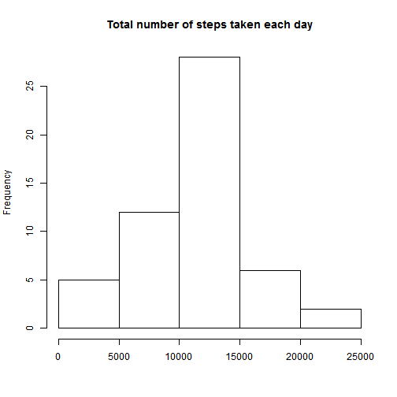

Introduction

This assignment makes use of data from a personal activity monitoring device. This device collects data at 5 minute intervals through out the day. The data consists of two months of data from an anonymous individual collected during the months of October and November, 2012 and include the number of steps taken in 5 minute intervals each day.


Loading and preprocessing the data

1. Load the data

Before beginning, please ensure the data file ("activity.csv") is unzipped and located in the working directory.

First, we will need to unzip the file and read it into R:

```r
activity <- read.csv("activity.csv", header = TRUE)
```

2. Process/transform the data (if necessary) into a format suitable for your analysis

Check the formats for all variables in the dataset:

```r
str(activity)
```

```
## 'data.frame':	17568 obs. of  3 variables:
##  $ steps   : int  NA NA NA NA NA NA NA NA NA NA ...
##  $ date    : Factor w/ 61 levels "2012-10-01","2012-10-02",..: 1 1 1 1 1 1 1 1 1 1 ...
##  $ interval: int  0 5 10 15 20 25 30 35 40 45 ...
```

Because the "date" variable is character format rather than date format, we need to convert it to date:

```r
activity$date <- as.Date(activity$date)
```

What is mean total number of steps taken per day?

NB. As per instructions on the assignment page, I ignored the missing values in the dataset. I will deal with them below.

1. Calculate the total number of steps taken per day

```r
stepsbyday <- aggregate(steps ~ date, data = activity, sum)
```

2. Make a histogram of the total number of steps taken each day

```r
hist(stepsbyday$steps, main = "Total number of steps taken each day", xlab = "")
```

 

3. Calculate the mean and median of steps taken per day

```r
mean(stepsbyday$steps)
```

```
## [1] 10766.19
```

```r
median(stepsbyday$steps)
```

```
## [1] 10765
```

What is the average daily activity pattern?

NB. For this part of the assignment it does not instruct us to impute missing values, so I chose to do the calculations first. I will deal with the missing values in the next section.

1. Make a time series plot (i.e. type = "l") of the 5-minute interval (x-axis) and the average number of steps taken, averaged across all days (y-axis)

```r
stepsbyinterval <- aggregate(steps ~ interval, data = activity, mean)
plot(stepsbyinterval, type = "l", main = "Activity pattern in 5-minute intervals", xlab = "5-minute interval")
```

 

2. Which 5-minute interval, on average across all the days in the dataset, contains the maximum number of steps?

```r
stepsbyinterval[which.max(stepsbyinterval$steps),]
```

```
##     interval    steps
## 104      835 206.1698
```


Imputing missing values

1. Calculate and report the total number of missing values in the dataset (i.e. the total number of rows with NAs)

```r
length(which(is.na(activity$steps)))
```

```
## [1] 2304
```

```r
length(which(is.na(activity$date)))
```

```
## [1] 0
```

```r
length(which(is.na(activity$interval)))
```

```
## [1] 0
```

We now find that it is only in the "steps" variable where we have missing values.

2. Devise a strategy for filling in all of the missing values in the dataset.

For this dataset, I chose to replace the missing values in an interval with the average for that interval across all days.

3. Create a new dataset that is equal to the original dataset but with the missing data filled in.

```r
new_activity <- merge(activity, stepsbyinterval, by = "interval", suffixes = c("", ".mean"))
new_activity <- new_activity[order(new_activity$date, new_activity$interval),]
new_activity$steps <- ifelse(is.na(new_activity$steps), new_activity$steps.mean, new_activity$steps)
new_activity$steps.mean <- NULL
```

Verify that there are no more missing values:

```r
length(which(is.na(new_activity$steps)))
```

```
## [1] 0
```

4. Make a histogram of the total number of steps taken each day. Calculate and report the mean and median total number of steps taken per day.

```r
new_hist <- aggregate(steps ~ date, data = new_activity, sum)
hist(new_hist$steps, main = "Total number of steps taken per day (imputed)", xlab = "Steps")
```

 

```r
mean(new_hist$steps)
```

```
## [1] 10766.19
```

```r
median(new_hist$steps)
```

```
## [1] 10766.19
```

There does not seem to be a big difference between our imputed graph and the original graph. In addition, the mean between the original data and the imputed data is unchanged (unsurprisingly). The difference is in the median (the middle value), which has increased from 10765 in our original data to 10766.19 in our imputed data.

Are there differences in activity patterns between weekdays and weekends?

1. Create a new factor variable in the dataset with two levels - "weekday" and "weekend" indicating whether a given date is a weekday or weekend day.

```r
new_activity$day <- weekdays(new_activity$date, abbreviate = FALSE)
new_activity$day_of_week <- ifelse(new_activity$day == "Saturday", "weekend", ifelse(new_activity$day == "Sunday", "weekend", "weekday"))
```

2. Make a panel plot containing a time series plot (i.e. type = "l") of the 5-minute interval (x-axis) and the average number of steps taken, averaged across all weekday days or weekend days (y-axis).

This function will calculate the mean for the intervals depending on the day of the week (weekday or weekend).

```r
day_by_interval <- aggregate(steps ~ interval + day_of_week, data = new_activity, mean)
```

This should show a panel plot of the weekday calculation compared with the weekend calculation.

```r
library(lattice)
xyplot(steps ~ interval | day_of_week, data = day_by_interval, layout = c(1,2), type = "l")
```

 

It appears that the participant is much more active on the weekends than on weekdays.
